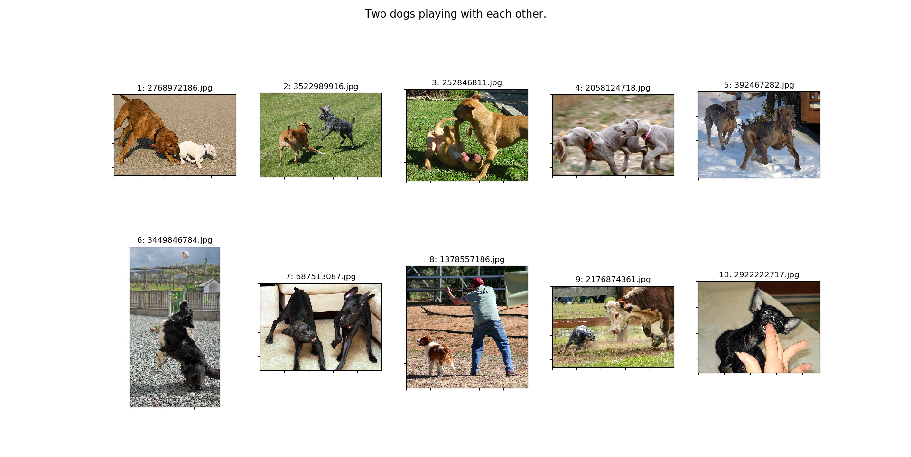

# Text-based information retrieval

**Given a text caption, retrieve the most resembling images and order them according to their level of resemblance.**

  > **Exemplar Search Caption**: `"Two dogs playing with each other."`
  > 

This project was completed as part of the course Text-based information retrieval at KU Leuven (2020).
All images stem from the [FLICKR30K dataset](https://forms.illinois.edu/sec/229675).
The train/validation/test dataset splits are the same as in [Flickr30k Entities](https://github.com/BryanPlummer/flickr30k_entities).


## How to use

The models are already (rudimentary) trained.
In order to reproduce the results from above, you have to pull this repository and download the image dataset. Then run:

  ```console
  foo@bar:~$ python main_part1.py --query "Two dogs playing with each other."
  ```


## References

  * [Learning Deep Structure-Preserving Image-Text Embeddings](https://arxiv.org/abs/1511.06078): Implemented in [main_part1.py](main_part1).
  * [Deep Cross-Modal Hashing](https://arxiv.org/abs/1602.02255): Implemented in [main_part2.py](main_part2.py).


## Technology stack

  * Python 3.8.2
  * PyTorch 1.5.0
  * matplotlib 3.1.3
  * scikit-learn 0.22.1 (used for BOW)  
  * Pandas 1.0.3 (used for preprocessing)
